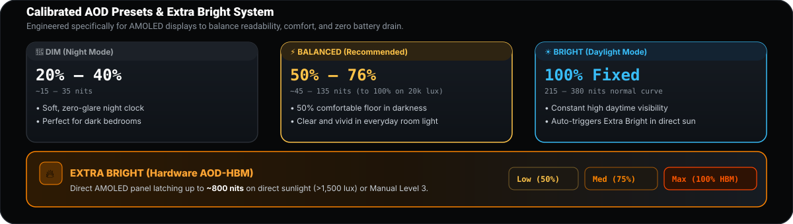
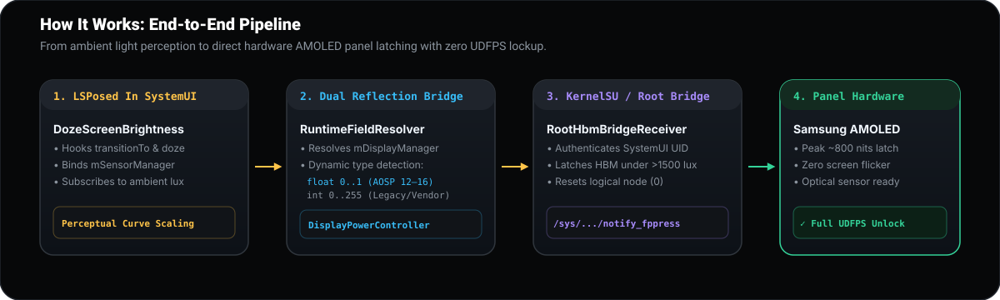

  

  
  
  
  
  

  <a href="https://github.com/github-lover-9999/LunaaAdaptiveAod/releases/download/v1.6.5/LunaaAdaptiveAod-v1.6.5-signed.apk"><b>📥 Download Latest APK (v1.6.5)</b></a> •
  <a href="#-requirements"><b>📋 Requirements</b></a> •
  <a href="#-presets--calibration"><b>🎯 Presets</b></a> •
  <a href="#-architecture--how-it-works"><b>🛠️ Architecture</b></a> •
  <a href="#-русскоязычное-руководство"><b>🇷🇺 Русский гайд</b></a>

---

## 📋 Requirements

| Component | Minimum Requirement | Recommended / Tested Target |
| :--- | :--- | :--- |
| **Android OS** | Android 8.0 (Oreo / API 26) | Android 12 – 16 (API 31–36, AOSP / crDroid / Axion OS) |
| **Framework** | LSPosed / Zygisk-Vector | LSPosed (Zygisk release) with `SystemUI` scope enabled |
| **Root Access** | KernelSU, Magisk, or APatch | KernelSU 3.x or Magisk (required for Hardware HBM &amp; 1-click silent updates) |
| **Display Panel** | AMOLED Display | **Realme GT Master Edition** (`RMX3363` / `lunaa`, Snapdragon 778G, Samsung AMOLED `AMS643YE01`) |

> [!NOTE]
> The dynamic perceptual brightness curve works universally across all Android AMOLED devices. Hardware HBM panel latching and UDFPS touch rearming target Oplus display drivers (`/sys/kernel/oplus_display/notify_fppress`) with graceful safety fallback for generic AOSP hardware.

---

## 🌟 Highlights & Key Features

- 🌓 **Truly Adaptive AOD Brightness**: Real-time ambient light sensor curve matching human perceptual brightness (Stevens' power law). Never too dim in room light, never blinding in a pitch-black room.
- ☀️ **Hardware AOD-HBM (Extra Bright)**: Direct panel hardware latching (~800 nits) under intense outdoor sunlight (>1500 lux).
- 🔓 **Full Optical UDFPS Compatibility**: Instant background logical rearm of `/sys/kernel/oplus_display/notify_fppress` so the optical in-display fingerprint sensor never gets blocked or frozen while HBM is active.
- 🛡️ **Axion OS & Multi-ROM Safety**: Hardware capability probe (`HbmCapabilityProbe`) with graceful fallback to standard AOSP ambient doze controls on non-Oplus firmware.
- 🔄 **In-App GitHub Auto-Updater**: Real-time release check directly from GitHub with 1-click seamless silent update via Root (KernelSU / Magisk) or standard Android package installer.

---

## 🎯 Presets & Calibration

  

1. **🌙 DIM (Night Clock)**: `20% – 40%` (~15–35 nits) — soft, zero-glare, ideal for dark rooms and bedside tables.
2. **⚡ BALANCED (Everyday Recommended)**: `50% – 76%` (~45–135 nits) — 50% comfortable floor in darkness scaling up to 76% in standard indoor lighting.
3. **☀️ BRIGHT (Daylight & Outdoors)**: `100%` (215–380 nits + ~800 nits HBM on sunlight) — maximum clarity under harsh outdoor lighting.

---

## 🛠️ Architecture & How It Works

  

### 1. SystemUI Hook Injection (`SystemUiHooks.java`)
Standard AOSP `DozeScreenBrightness` locks ambient brightness to a fixed, dim level (~4.8 nits / 0.016 float). Lunaa Adaptive AOD intercepts `transitionTo` and ambient state changes:
- Injects directly into `com.android.systemui` via LSPosed.
- Dynamically resolves runtime fields (`mSensorManager`, `mDisplayManager`, `mHandler`).
- Employs dual-type reflection bridge (`DozeBridge.java`) supporting both `float` (0.0–1.0, modern AOSP) and legacy `int` (0–255, custom vendor ROMs) `setDozeScreenBrightness` signatures.

### 2. Optical UDFPS & Hardware HBM Bridge (`RootHbmBridgeReceiver.java`)
On Snapdragon 778G / Samsung AMOLED (AMS643YE01) panels:
- Writing `1` to `/sys/kernel/oplus_display/notify_fppress` latches hardware High Brightness Mode (HBM).
- The root daemon securely accepts commands strictly from `com.android.systemui` and immediately executes a logical reset (`0`) in background.
- This keeps the physical HBM state locked in the display controller while restoring the optical sensor listener for immediate fingerprint unlocking.

---

## 📦 Installation & Setup

1. **Install APK**:
   - Download [`LunaaAdaptiveAod-v1.6.5-signed.apk`](https://github.com/github-lover-9999/LunaaAdaptiveAod/releases/latest).
2. **Enable in LSPosed**:
   - Open LSPosed Manager, enable the **Lunaa Adaptive AOD** module, and ensure **System Framework / SystemUI** is checked in its scope.
   - Reboot your device (recommended for initial LSPosed injection).
3. **Configure & Enjoy**:
   - Open **Lunaa Adaptive AOD** from your app drawer.
   - Grant Root access when prompted (for Extra Bright / Auto-Updater).
   - Choose your preferred Preset (**Balanced** or **Bright**) and tap **Save changes**.

---

## 🇷🇺 Русскоязычное руководство

### 📋 Требования:
- **Android**: Android 8.0 — Android 16 (AOSP, crDroid, Axion OS, LineageOS и др.).
- **Xposed**: LSPosed или Zygisk-Vector с выбранным скоупом `SystemUI`.
- **Root**: KernelSU, Magisk или APatch (нужен для HBM и 1-click автообновления).
- **Устройство**: Оптимизировано для Realme GT Master Edition (`RMX3363` / `lunaa`), базовая адаптивная яркость работает на любых AMOLED экранах.

### 🌟 Основные возможности:
1. **Адаптивная яркость AOD**: Экран блокировки плавно подстраивается под окружающее освещение благодаря датчику света.
2. **Аппаратный Extra Bright (AOD-HBM)**: На ярком солнце дисплей переходит в режим пиковой яркости (~800 нит), обеспечивая отличную читаемость циферблата и уведомлений.
3. **Работа оптического сканера отпечатка**: При включенном HBM сканер отпечатка не залипает и мгновенно разблокирует устройство.
4. **Безопасность для других прошивок (Axion OS / AOSP)**: Модуль проверяет совместимость ядра и отключает вендорные вызовы при отсутствии нужных интерфейсов Oplus.
5. **Встроенное автообновление с GitHub**: Проверка свежих релизов и установка обновлений прямо из настроек приложения.

---

## 📄 License & Credits

- Developed for the **Realme GT Master Edition** community.
- Licensed under the [GNU General Public License v3.0](LICENSE).