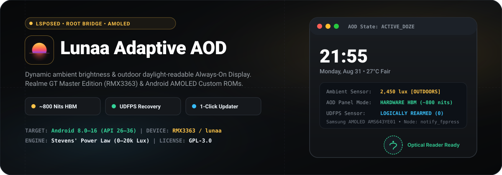
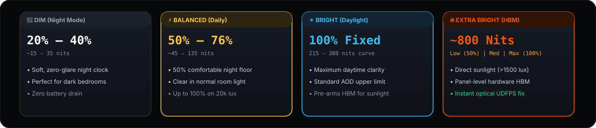

  

  
  
  
  
  
  

  <a href="https://github.com/github-lover-9999/LunaaAdaptiveAod/releases/latest"><b>📥 Download Latest APK</b></a> •
  <a href="#-requirements"><b>📋 Requirements</b></a> •
  <a href="#-how-to-install--use"><b>🚀 How to Install &amp; Use</b></a>
   
  <a href="#-presets--brightness-modes"><b>🎯 Presets &amp; Modes</b></a> •
  <a href="#-extra-bright-hardware-aod-hbm"><b>🔥 Extra Bright (HBM)</b></a> •
  <a href="#-architecture--how-it-works"><b>🛠️ Architecture</b></a> •
  <a href="#-русскоязычное-руководство"><b>🇷🇺 Русский гайд</b></a>

---

## 📋 Requirements

| Component | Minimum Requirement | Recommended / Tested Target |
| :--- | :--- | :--- |
| **Android OS** | Android 8.0 (Oreo / API 26) | Android 12 – 16 (API 31–36, AOSP / crDroid / Axion OS) |
| **Framework** | LSPosed / Zygisk-Vector | LSPosed (Zygisk release) with `System Framework` and `SystemUI` scope enabled |
| **Root Access** | KernelSU, Magisk, or APatch | KernelSU 3.x or Magisk (required for Hardware HBM &amp; 1-click silent updates) |
| **Display Panel** | AMOLED Display | **Realme GT Master Edition** (`RMX3363` / `lunaa`, Snapdragon 778G, Samsung AMOLED `AMS643YE01`) |

> [!NOTE]
> The dynamic perceptual brightness curve works universally across all Android AMOLED devices. Hardware HBM panel latching and UDFPS touch rearming target Oplus display drivers (`/sys/kernel/oplus_display/notify_fppress`) with graceful safety fallback for generic AOSP hardware.

---

## 🚀 How to Install & Use

1. **📥 Download & Install APK**:
   - Grab the latest signed APK from [Releases](https://github.com/github-lover-9999/LunaaAdaptiveAod/releases/latest).
2. **⚙️ Enable in LSPosed**:
   - Open **LSPosed Manager** (or Zygisk-Vector).
   - Enable the **Lunaa Adaptive AOD** module.
   - Check both **System Framework** (`android`) and **System UI** (`com.android.systemui`) in the module's scope. System UI sets the AOD brightness; System Framework makes each AOD brightness change land at once (without it the ROM stretches every change over up to 3 seconds).
   - Reboot your phone (required after changing the scope).
3. **🎛️ Configure & Save**:
   - Open **Lunaa Adaptive AOD** from your launcher.
   - Grant **Root access** when prompted (required for Extra Bright HBM and 1-click updates).
   - Select your preferred preset (**⚡ Balanced** for daily use or **☀️ Bright** for maximum outdoor visibility).
   - Tap **Save changes**. Lock your device to enjoy daylight-readable, adaptive Always-On Display!

---

## 🌟 Highlights & Key Features

- 🌓 **Truly Adaptive AOD Brightness**: Real-time ambient light sensor curve matching human perceptual brightness (Stevens' power law). Never too dim in room light, never blinding in a pitch-black room.
- 🔥 **Hardware AOD-HBM (Extra Bright)**: Direct panel hardware latching (~800 nits) under intense outdoor sunlight (>1500 lux) or on demand in manual mode.
- 🔓 **Full Optical UDFPS Compatibility**: Instant background logical rearm of `/sys/kernel/oplus_display/notify_fppress` so the optical in-display fingerprint sensor never gets blocked or frozen while HBM is active.
- 🔋 **Keep AOD on in Battery Saver** (optional): Battery Saver no longer turns AOD off; its other limits stay.
- 🛡️ **Axion OS & Multi-ROM Safety**: Hardware capability probe (`HbmCapabilityProbe`) with graceful fallback to standard AOSP ambient doze controls on non-Oplus firmware.
- 🔄 **In-App GitHub Auto-Updater**: Real-time release check directly from GitHub with 1-click seamless silent update via Root (KernelSU / Magisk) or standard Android package installer.

---

## 🎯 Presets & Brightness Modes

  

### 1. Automatic Mode (3 Calibrated Presets)
Percentages are shares of the brightest normal (non-HBM) AOD brightness, as in Manual mode, so Balanced stays below Bright until the brightest light.
- **🌙 DIM (Night Clock)**: `20% – 40%` (~15–35 nits) — soft, zero-glare, ideal for dark rooms and bedside tables.
- **⚡ BALANCED (Everyday Recommended)**: `50% – 76%` (~45–135 nits, up to 100% on 20,000 lux) — 50% comfortable floor in darkness scaling smoothly in indoor lighting.
- **☀️ BRIGHT (Daylight Mode)**: `100%` (215–380 nits) — maximum daytime visibility on standard AOD curve; automatically activates Extra Bright HBM outdoors.

### 2. Manual Mode (Fixed 3-Step Slider)
- Allows setting fixed brightness levels without ambient sensor adaptation. The percentages are shares of the brightest normal (non-HBM) AOD brightness: on lunaa AOD shows nothing brighter than the HBM transition point (0.735 of the brightness range, backlight 2047 of 2784), so 100% is that level. In AOD the panel runs in its low-power mode, so the same level looks much dimmer than on the normal screen.
  - **Dim**: Default 25% (customizable in Advanced Settings).
  - **Balanced**: Default 55% (customizable in Advanced Settings).
  - **Bright**: Default 100% (customizable in Advanced Settings, supports Extra Bright toggle). Brighter than that is only possible with Extra Bright.

---

## 🔥 Extra Bright (Hardware AOD-HBM)

**Extra Bright** is a specialized hardware-level High Brightness Mode engineered specifically for AMOLED screens to make the Always-On Display crystal clear under blinding direct sunlight.

### How It Works:
- Directly communicates with the kernel display driver (`/sys/kernel/oplus_display/notify_fppress`) via a secure root bridge.
- Bypasses standard AOSP doze brightness limits and forces the AMOLED panel into peak hardware HBM (**~800 nits**).

### How It Activates:
1. **Automatic Mode**: When using the **☀️ Bright** preset, Extra Bright automatically engages when the ambient sensor detects outdoor sunlight (**> 1,500 lux**). To prevent display driver desynchronization and ensure 100% reliable optical fingerprint unlocking, HBM remains safely latched for the duration of the AOD session until the screen is unlocked.
2. **Manual Mode**: When Manual Brightness is set to **Level 3 (Bright)**, enabling the **Extra Bright** toggle forces hardware HBM for the entire AOD session.

### Strength Levels:
The Extra Bright slider supports 3 calibrated strength levels (customizable under Advanced Settings):
- **Low**: `50%` HBM strength.
- **Medium**: `75%` HBM strength.
- **Max**: `100%` full panel HBM (~800 nits peak).

### 🔓 Optical Fingerprint (UDFPS) Instant Recovery:
On many custom ROMs, forcing HBM locks up the optical fingerprint scanner. Lunaa Adaptive AOD solves this by having the root daemon immediately perform a background logical reset (`notify_fppress = 0`) while preserving physical display latching. The optical fingerprint reader remains 100% responsive and unlocks instantly.

---

## 🔋 Keep AOD on in Battery Saver

Android's Battery Saver turns AOD off (policy entry `disable_aod`). With **Keep AOD on in Battery Saver** switched on (its own card in the app, off by default), AOD stays on while Battery Saver keeps all its other limits.

- Needs **System Framework** in the module scope.
- SystemUI asks about AOD each time Battery Saver turns on or off, so the option applies the next time Battery Saver turns on. If Battery Saver is already on, turn it off and on again.
- The option does not depend on the AOD brightness switch, and it does not turn AOD on: enable AOD in the phone's settings.

---

## 🛠️ Architecture & How It Works

  

### 1. SystemUI Hook Injection (`SystemUiHooks.java`)
Standard AOSP `DozeScreenBrightness` locks ambient brightness to a fixed, dim level (~4.8 nits / 0.016 float). Lunaa Adaptive AOD intercepts `transitionTo` and ambient state changes:
- Injects directly into `com.android.systemui` via LSPosed.
- Dynamically resolves runtime fields (`mSensorManager`, `mDisplayManager`, `mHandler`).
- Employs dual-type reflection bridge (`DozeBridge.java`) supporting both `float` (0.0–1.0, modern AOSP) and legacy `int` (0–255, custom vendor ROMs) `setDozeScreenBrightness` signatures.

### 2. System Framework Hook (`SystemServerHooks.java`)
lunaa's display config ramps every brightness change at 0.06 per second (perceived scale) for up to 3 seconds, which made each AOD change a slow, stepped rise.
- Hooks `DisplayPowerController.animateScreenBrightness` in `system_server`.
- While the display power policy is doze and the module is on, the ramp rate becomes 0, so the change lands at once. The normal screen and unlock keep the stock ramp.
- Leaves a timestamp in `Settings.Global` (`lunaa_aod_instant_doze_ramp`) so SystemUI knows Extra Bright need not wait for a ramp. Without the System Framework scope everything else still works and Extra Bright waits for the ramp.
- `BatterySaverAodHook`: with **Keep AOD on in Battery Saver** on, the AOD answer of `BatterySaverPolicy.getBatterySaverPolicy` (`PowerManager.ServiceType.AOD`) no longer blocks AOD. The rest of the answer and every other Battery Saver limit stay unchanged. Nothing is written to the system settings, so switching the option off restores the stock policy.

### 3. Optical UDFPS & Hardware HBM Bridge (`RootHbmBridgeReceiver.java`)
On Snapdragon 778G / Samsung AMOLED (AMS643YE01) panels:
- Writing `1` to `/sys/kernel/oplus_display/notify_fppress` latches hardware High Brightness Mode (HBM).
- The root daemon securely accepts commands strictly from `com.android.systemui` and immediately executes a logical reset (`0`) in background.
- This keeps the physical HBM state locked in the display controller while restoring the optical sensor listener for immediate fingerprint unlocking.

---

## 🇷🇺 Русскоязычное руководство

### 📖 О проекте
**Lunaa Adaptive AOD** — специализированный модуль для LSPosed с поддержкой Root, предназначенный для динамического, плавного и комфортного управления яркостью экрана Always-On Display (AOD) на смартфонах с AMOLED-матрицами. Разработан и полностью оптимизирован для **Realme GT Master Edition (RMX3363 / lunaa)** и кастомных прошивок на базе AOSP (crDroid, Axion OS, LineageOS и др.).

---

### 📋 Системные требования

| Компонент | Минимальные требования | Рекомендуемая конфигурация |
| :--- | :--- | :--- |
| **ОС Android** | Android 8.0 (Oreo / API 26) | Android 12 – 16 (API 31–36, AOSP / crDroid / Axion OS) |
| **Xposed фреймворк** | LSPosed / Zygisk-Vector | LSPosed (Zygisk релиз) с включенными скоупами `Системный фреймворк` и `SystemUI` |
| **Root-доступ** | KernelSU, Magisk или APatch | KernelSU 3.x или Magisk (нужен для HBM и автообновлений) |
| **Дисплей** | AMOLED экран | **Realme GT Master Edition** (`RMX3363` / `lunaa`, Snapdragon 778G, Samsung AMOLED `AMS643YE01`) |

> [!NOTE]
> Математическая адаптивная кривая яркости работает на любых смартфонах с AMOLED экранами. Аппаратный режим HBM и защита оптического сканера отпечатка пальца используют драйверы Oplus (`/sys/kernel/oplus_display/notify_fppress`) с автоматической безопасной заглушкой для стандартных устройств AOSP.

---

### 🚀 Пошаговая установка и использование

1. **📥 Установка приложения**:
   - Скачайте свежий подписанный APK из раздела [Releases](https://github.com/github-lover-9999/LunaaAdaptiveAod/releases/latest).
2. **⚙️ Активация в LSPosed**:
   - Откройте приложение **LSPosed Manager** (или Zygisk-Vector).
   - Включите модуль **Lunaa Adaptive AOD**.
   - Отметьте в списке приложений для модуля **Системный фреймворк** (`android`) и **Системный интерфейс** (`com.android.systemui`). Системный интерфейс задаёт яркость AOD, а системный фреймворк делает так, чтобы каждое изменение яркости применялось сразу (без него прошивка растягивает каждое изменение до 3 секунд).
   - Перезагрузите смартфон (обязательно после изменения списка).
3. **🎛️ Настройка и сохранение**:
   - Запустите **Lunaa Adaptive AOD** с рабочего стола.
   - Предоставьте **Root-права** при появлении системного запроса (необходимы для Extra Bright HBM и автообновления).
   - Выберите желаемый профиль (**⚡ Balanced** для повседневного использования или **☀️ Bright** для яркого солнца).
   - Нажмите **Save changes** (Сохранить). Заблокируйте телефон — адаптивный Always-On Display готов к работе!

---

### 🌟 Ключевые возможности

- 🌓 **Плавная адаптивная яркость**: Экран AOD в реальном времени подстраивается под данные датчика света по психофизическому закону Стивенса. Он не слепит глаза в темноте и отлично читается при обычном комнатном освещении.
- 🔥 **Аппаратный Extra Bright (AOD-HBM)**: Принудительный аппаратный перевод AMOLED-панели в пиковую яркость (~800 нит) на открытом солнце (>1500 люкс) или вручную.
- 🔋 **AOD при экономии заряда** (по желанию): режим энергосбережения больше не выключает AOD, остальные его ограничения остаются.
- 🔓 **Полная совместимость с оптическим сканером (UDFPS)**: Фоновый логический сброс `/sys/kernel/oplus_display/notify_fppress` исключает зависание оптического сенсора — разблокировка пальцем остается мгновенной.
- 🛡️ **Защита для других прошивок (Axion OS / AOSP)**: Аппаратный зонд ядра проверяет наличие интерфейсов и безопасно отключает вызовы драйвера на сторонних устройствах.
- 🔄 **Встроенное автообновление с GitHub**: Проверка свежих версий прямо в приложении и 1-click тихая установка через Root (KernelSU / Magisk) либо стандартный установщик пакетов.

---

### 🎯 Режимы работы и пресеты яркости

1. **Автоматический режим (3 калиброванных пресета)**. Проценты считаются так же, как в ручном режиме: от самой яркой обычной (без HBM) яркости AOD, поэтому Balanced остаётся тусклее Bright вплоть до самого яркого света:
   - **🌙 DIM (Ночной режим)**: `20% – 40%` (~15–35 нит) — мягкий, не отвлекающий ночной циферблат для темных комнат и спальни.
   - **⚡ BALANCED (Повседневный, рекомендуемый)**: `50% – 76%` (~45–135 нит, масштабируется до 100% при 20 000 люкс) — комфортный базовый уровень 50% в темноте с плавным повышением в помещении.
   - **☀️ BRIGHT (Дневной режим)**: `100%` (215–380 нит) — максимальная яркость стандартной кривой AOD с авто-триггером Extra Bright на солнце.
2. **Ручной режим (Manual Mode)**:
   - 3 фиксированных положения ползунка: **Dim** (25%), **Balanced** (55%) и **Bright** (100%), точные проценты которых можно настроить в разделе Advanced Settings. Проценты считаются от самой яркой обычной (без HBM) яркости AOD: на lunaa AOD не показывает ничего ярче точки перехода HBM (0.735 диапазона яркости, подсветка 2047 из 2784), поэтому 100% — это она. В AOD панель работает в экономичном режиме, поэтому тот же уровень выглядит заметно тусклее, чем на обычном экране. Ярче только с Extra Bright.

---

### 🔥 Аппаратный Extra Bright (AOD-HBM)

**Extra Bright** — режим пиковой аппаратной яркости High Brightness Mode, разработанный специально для AMOLED-экранов для обеспечения 100% читаемости Always-On Display под прямыми солнечными лучами.

#### Как это работает:
- Модуль напрямую взаимодействует с драйвером дисплея в ядре (`/sys/kernel/oplus_display/notify_fppress`) через защищенный Root-мост.
- Обходит стандартные ограничения яркости AOSP Doze и переводит AMOLED-матрицу в аппаратный режим HBM (**~800 нит**).

#### Условия активации:
1. **В авторежиме**: При выбранном пресете **☀️ Bright** Extra Bright автоматически включается, когда датчик света фиксирует уличное солнце (**> 1500 люкс**). Чтобы исключить сбои в работе оптического сканера и гарантировать 100% стабильную разблокировку пальцем, режим HBM надежно фиксируется до конца текущей сессии AOD (до разблокировки экрана).
2. **В ручном режиме**: При выборе 3 уровня яркости (Bright) включение тумблера **Extra Bright** активирует HBM на весь сеанс AOD.

#### Уровни мощности:
Ползунок Extra Bright поддерживает 3 калиброванных уровня силы:
- **Low**: `50%` мощности HBM.
- **Medium**: `75%` мощности HBM.
- **Max**: `100%` полная пиковая яркость панели (~800 нит).

#### 🔓 Мгновенная разблокировка по отпечатку (UDFPS):
На многих кастомных прошивках принудительное включение HBM блокирует работу оптического подэкранного сканера отпечатков. Lunaa Adaptive AOD решает эту проблему: root-демон мгновенно отправляет логический сброс (`notify_fppress = 0`), сохраняя физическую яркость на матрице. Оптический сканер не зависает и моментально распознает палец.

---

### 🔋 AOD при экономии заряда

Режим энергосбережения Android выключает AOD (параметр `disable_aod`). Если включить **Keep AOD on in Battery Saver** (отдельная карточка в приложении, по умолчанию выключено), AOD остаётся, а все остальные ограничения энергосбережения продолжают работать.

- Нужен скоуп **«Системный фреймворк»**.
- SystemUI спрашивает про AOD в момент включения или выключения энергосбережения, поэтому опция срабатывает со следующего включения. Если энергосбережение уже включено, выключите и снова включите его.
- Опция не зависит от переключателя яркости AOD и не включает сам AOD: его нужно включить в настройках телефона.

---

### 🛠️ Архитектура и внутренняя работа

1. **Внедрение хуков в SystemUI (`SystemUiHooks.java`)**:
   - Перехват состояний засыпания экрана `DozeScreenBrightness` и `transitionTo`.
   - Динамическое разрешение полей через `RuntimeFieldResolver` (`mSensorManager`, `mDisplayManager`, `mHandler`).
   - Мост `DozeBridge.java` для прозрачной поддержки сигнатур как `float` (0.0–1.0, modern AOSP), так и `int` (0–255, вендорные прошивки).
2. **Хук в системном фреймворке (`SystemServerHooks.java`)**:
   - Прошивка lunaa растягивает каждое изменение яркости до 3 секунд (0.06 в секунду по шкале восприятия), поэтому AOD разгорался медленно и ступеньками.
   - Хук `DisplayPowerController.animateScreenBrightness` в `system_server`: пока экран в режиме AOD и модуль включён, изменение яркости применяется сразу. Обычный экран и разблокировка не затронуты.
   - Метка времени в `Settings.Global` (`lunaa_aod_instant_doze_ramp`) сообщает SystemUI, что Extra Bright можно включать без ожидания. Без скоупа «Системный фреймворк» всё остальное работает, а Extra Bright ждёт окончания плавного перехода.
   - `BatterySaverAodHook`: при включённой опции ответ `BatterySaverPolicy.getBatterySaverPolicy` для AOD больше не запрещает AOD. Остальные значения и ограничения энергосбережения не меняются, в системные настройки ничего не записывается.
3. **Root-мост для ядра Oplus (`RootHbmBridgeReceiver.java`)**:
   - Защищенный прием команд строго от UID SystemUI.
   - Аппаратная фиксация HBM и автоматический сброс логического узла сканера отпечатка пальца.

---

## 📄 License & Credits

- Developed for the **Realme GT Master Edition** community.
- Licensed under the [GNU General Public License v3.0](LICENSE).
- The Battery Saver option follows the approach of [AOD Battery Saver Override](https://github.com/mirsella/aod-battery-saver-override) by mirsella (Apache-2.0).